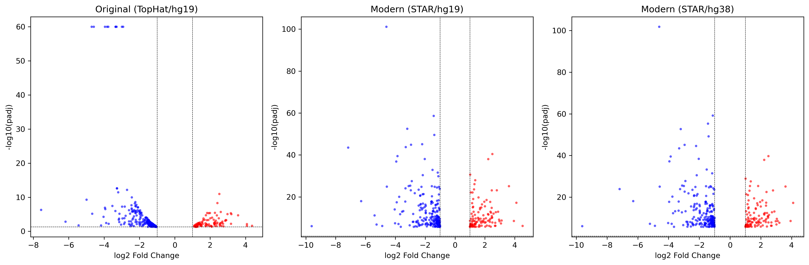
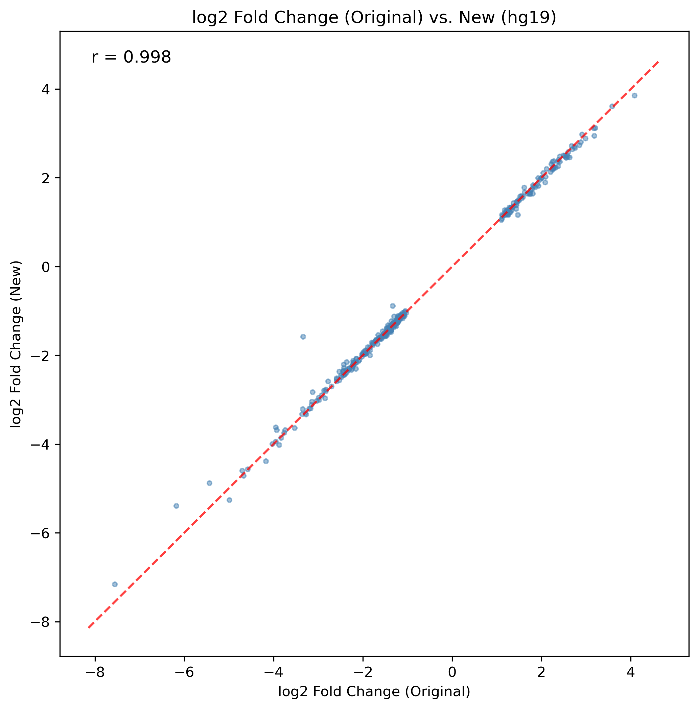

# Glucocorticoid-Responsive Genes in Airway Smooth Muscle Cells: A Comparison of Modern and the Original RNA-seq Pipelines

[Latex Rendered Version](LatexRender.pdf) - Generated using [Overleaf](https://www.overleaf.com/) and edited for grammar using Grammarly.

*This is a replication study of the 2014 original paper [RNA-Seq Transcriptome Profiling Identifies CRISPLD2 as a Glucocorticoid Responsive Gene that Modulates Cytokine Function in Airway Smooth Muscle Cells (by Blanca E. Himes and Xiaofeng Jiang )](https://doi.org/10.1371/journal.pone.0099625)*

*I am not a biologist, and I know I will have trouble with the biological interpretation of the results. I will perform statistical analysis and interpret the results from the statistical perspective.*

## Abstract
RNA-seq analysis pipelines have evolved significantly since 2014, with improvements in alignment algorithms, quantification methods and analysis tools. Using a newer pipeline and reference genome,
We reanalyzed the dataset [GSE52778](https://www.ncbi.nlm.nih.gov/geo/query/acc.cgi?acc=GSE52778) - RNA-seq data from eight airway smooth muscle cells (ASM) from four donors.
The dataset was used in the original paper to characterize transcriptomic changes in human ASM cells treated with dexamethasone (potent glucocorticoid).
The original paper used the Tuxedo tools, TopHat2 for alignment and Cufflinks+Cuffdiff for quantification and differential expression analysis with reference genome **hg19**.<br/>
In this study, we modernized the pipeline using STAR, featureCounts and DESeq2, and also compared the reference genome effect, by running the pipeline on both the original reference genome **hg19** 
and the latest reference genome available **hg38**. The STAR alignment achieved a 97.6% mapping rate compared to 83.4% in the original paper. Junction-spanning reads were also improved from 26% to 45%. 
Despite the technical metric improvements, we have re-discovered and validated 96.2% (304/316) (with **hg19**) of the genes identified by the original paper with **0.998** Pearson correlation between the log2 fold changes.
The modern pipeline with the new reference genome also identified a total of 909 significant differentially expressed genes (padj < 0.05 and |log2FoldChange| > 1), reflecting higher sensitivity.
Although the reference genome effect was not significant, it might still be interesting for biological interpretation.<br/>
We conclude that the original well-designed RNA-seq analysis was robust to pipeline variations and would likely still benefit from the modern tooling.

## 1. Introduction

### 1.1 Pipeline Background
RNA-seq is a widely used method to study transcriptomes in cells. The tools for alignment evolved significantly. One of the most effective tools for alignment we have today - STAR,
was first introduced in a paper published at the end of 2012 ([PMC3530905](https://doi.org/10.1093/bioinformatics/bts635)).<br/>
In 2013 a paper was published (["Systematic evaluation of spliced alignment programs for RNA-seq data"](https://www.nature.com/articles/nmeth.2722)) that compared the performance of several alignment tools.<br>
GSNAP, GSTRUCT, MapSplice, and STAR emerged as the top performers. But the interesting thing about STAR was its performance, it performed about 180x faster than GSNAP and MapSplice while maintaining comparable accuracy and in some cases improved junction-spanning with two passes.
This allowed STAR to be run on a single modern computer and take a few hours to perform alignment instead of days, making discovery and iteration faster, cheaper and overall more accessible. Running the scripts in this repository took around 2 hours in total. 
For assigning sequence reads to genomic features, the pipeline uses [featureCounts (published in 2013 paper)](https://doi.org/10.1093/bioinformatics/btt656) which is another highly efficient tool, order of magnitude faster than comparable tools like [HTSeq](https://htseq.readthedocs.io/en/release_0.11.1/).
For fold change and dispersion analysis, the pipeline uses a python version of [DESeq2 (published in 2014 paper)](https://doi.org/10.1186/s13059-014-0550-8).

### 1.2 Dataset
The dataset used in the paper is available at [GSE52778](https://www.ncbi.nlm.nih.gov/geo/query/acc.cgi?acc=GSE52778)
The dataset actually has 16 samples, combinations of untreated, treated with Albuterol and treated with Dexamethasone.
Since the study mostly focuses on the untreated and treated with dexamethasone (12 hours) samples, we will only use these two groups. 
The samples are listed in config/samples_table.tsv, four donors, two conditions.

#### Table 1: Samples Table

| sample_id         | srr_id     | condition | cell_line |
|-------------------|------------|-----------|-----------|
| N61311_untreated  | SRR1039508 | untreated | N61311    |
| N61311_dex        | SRR1039509 | dex       | N61311    |
| N052611_untreated | SRR1039512 | untreated | N052611   |
| N052611_dex       | SRR1039513 | dex       | N052611   |
| N080611_untreated | SRR1039516 | untreated | N080611   |
| N080611_dex       | SRR1039517 | dex       | N080611   |
| N061011_untreated | SRR1039520 | untreated | N061011   |
| N061011_dex       | SRR1039521 | dex       | N061011   |

### 1.3 Original Study Summary
The original paper used the Tuxedo tools, TopHat2 for alignment and Cufflinks+Cuffdiff for quantification and differential expression analysis with reference genome **hg19**.</br>
Analysis in the original paper found 316 genes that were significantly differentially expressed between the two conditions with p < 0.05.</br>
The **CRISPLD2** gene was identified as the novel finding by the paper. Here are the top gene findings from the original paper (padj < 1E-16 is marked as 0):

#### Table 2: Top DEGs from the original paper

| **Gene** | **log2 FC** | **P adj (Q)** |
|----------|-------------|---------------|
| C7       | -3.35       | 0             |
| CCDC69   | -2.92       | 0             |
| DUSP1    | -2.99       | 0             |
| FKBP5    | -3.95       | 0             |
| GPX3     | -3.76       | 0             |
| KLF15    | -4.58       | 0             |
| MAOA     | -3.29       | 0             |
| SAMHD1   | -3.83       | 0             |
| SERPINA3 | -3.34       | 0             |
| SPARCL1  | -4.70       | 0             |
| C13orf15 | -3.27       | 2.5E-13       |
| TSC22D3  | -3.27       | 2.5E-13       |
| CRISPLD2 | -2.70       | 6.9E-13       |


### 1.4 Study Design and Objectives
*You can find the original analysis description in the original paper, on page 9, paragraph "RNA-Seq Data Analysis."*

This study tries to separate **pipeline effects** from **reference genome effects** by performing two part analyses:

#### Table 3: Pipeline Effects

| Analysis     | Reference | Pipeline                    | Purpose                      |
|--------------|-----------|-----------------------------|------------------------------|
| **Original** | hg19      | TopHat/Cufflinks + Cuffdiff | Baseline (2014)              |
| **Part 1**   | hg19      | STAR/featureCount + DESeq2  | Isolate pipeline improvement |
| **Part 2**   | hg38      | STAR/featureCount + DESeq2  | Full modernization           |

We will try to validate the findings from the original paper and compare them to the findings from the modern pipeline.

#### 1.4.1 Expected Insights
- **Part 1 vs Original**: Effect of the updated pipeline
- **Part 2 vs Part 1**: Effect of updated genome assembly and annotation
- **Part 2 vs Original**: Combined modernization effect

## 2. Results

### 2.1 Alignment Quality
Modern STAR alignment achieved a 97.6% mapping rate compared to 83.4% in the original paper using TopHat2. Junction-spanning reads were also improved from 26% to 45%.
Indicating improvement in splice site detection by STAR. Although the read counts are lower.

#### Table 4: Alignment Summary

| Metric                 | hg19 (TopHat2) | hg19 (STAR+featureCount) | hg38 (STAR+featureCount) |
|------------------------|----------------|--------------------------|--------------------------|
| Reads (avg)            | 58.9M          | 48.9M                    | 48.9M                    |
| Reads (min)            | 44.2M          | 33.7M                    | 39.7M                    |
| Reads (max)            | 71.3M          | 68.6M                    | 68.6M                    |
| Mapped (avg)           | 83.36%         | 97.59%                   | 97.64%                   |
| Mapped (min)           | 81.94%         | 96.26%                   | 96.33%                   |
| Mapped (max)           | 84.34%         | 98.10%                   | 98.13%                   |
| Junctions Mapped (avg) | 26.43%         | 45.57%                   | 44.52%                   |
| Junctions Mapped (min) | NA             | 43.06%                   | 42.07%                   |
| Junctions Mapped (max) | NA             | 47.10%                   | 45.94%                   |

### 2.2 Gene Differential Expression Analysis
The original paper identified 316 genes significantly differentially expressed between the two conditions with p < 0.05.
The modern pipeline with the new reference genome also identified a total of 910 significant differentially expressed genes (padj < 0.05 and |log2FoldChange| > 1), reflecting higher sensitivity of DESeq2 analysis.

#### Table 5: DEG Summary
| Metric                                              | Original | hg19 Modern | hg38 Modern |
|-----------------------------------------------------|----------|-------------|-------------|
| Genes Tested                                        | 20 561   | 20 561      | 22 136      |
| DEGs (padj < 0.05)                                  | 316      | 2 648       | 2 735       |
| Significant DEGs <br/>(padj < 0.05 and \|LFC\| > 1) | N/A      | 872         | 909         |
| Upregulated                                         | 99       | 396         | 420         |
| Downregulated                                       | 219      | 476         | 489         |

#### Figure 1: Volcano plot
*Volcano plots show a similar distribution of gene expression changes across the three genome analyses. Genes are predominantly downregulated in all of them*



### 2.3 DEG correlations and validation
We have re-discovered and validated 96.2% (304/316) (with **hg19**) of the genes identified by the original paper with **0.998** Pearson correlation between the log2 fold changes.
With the updated genome **hg38**, we have validated 92.4% (292/316) of the genes with the correlation remaining the same at **0.998**.
Confirming both methods detects the similar biological effects.

*Although, the validation rate drop in the modern genome is mostly due to gene symbol changes, annotation updates, or minor coordinate shifts between genome builds rather than loss of biological signal.*
I have manually tracked down some (7) of the gene symbol changes, the figures do not reflect the corrections, but I have adjusted the percentage of validated genes accordingly.

#### Figure 2: Venn Diagram of DEG discovery
*Analysis with the updated genome validated one additional significant DEG (compared to hg19) from the original findings - **SERPINA3** and didn't find as strong of an effect with 16 genes.*


#### Figure 3: Pearson Correlation of log2 Fold Changes
*Between the original and modern analyses, the log2 fold changes are almost perfectly correlated with Pearson correlation of 0.998 for both genome versions. (Regardless of the reference genome used for alignment)*


#### Figure 4: Top DEGs LFC Barplot
*Looking at the top BEGs and their LFCs, we can see that they are almost identical between the modern and the original analyses. The DEGs with their directions and magnitudes of changes are also identical.*


### 2.4 Novel Findings
After analysis of the modern genome **hg38**, we have discovered some significant DEGs that were not found in the original paper.
Those might not have been possible to detect with the older pipeline or genome version. And those might be interesting for the further study and biological interpretation.

#### Table 6: Novel DEGs identified with HG38
*10 novel genes identified by the modern pipeline with hg38 reference genome having **padj(Q value) < 1E-10 and |log2FC| > 1***

| Gene             | padj     | log2FoldChange |
|------------------|----------|----------------|
| GASK1B (FAM198B) | 6.87E-60 | -1.12          |
| RAB7B            | 4.66E-26 | 1.83           |
| ENSG00000250978  | 8.37E-19 | -6.30          |
| MARCHF10         | 1.87E-18 | -3.96          |
| LINC02884        | 2.10E-13 | -3.13          |
| RELL1            | 1.52E-11 | -1.12          |
| HMGA2-AS1        | 3.61E-11 | -2.35          |
| PEAK1            | 8.70E-11 | -1.00          |
| MIR99AHG         | 2.45E-10 | 1.51           |
| AOPEP            | 8.45E-10 | -1.10          |


## 3. Discussion

### 3.1 Modernization of the Alignment and Analysis Pipeline
The transition from TopHat2/Cufflinks to STAR/featureCounts/DESeq2 resulted in technical improvements while preserving biological findings.
Alignment rates increased by 14 percentage points (83.4% → 97.6%), indicating that STAR's splice site detection algorithm works better to map RNA-seq reads to the reference genome.
Junction-spanning reads were also improved from 26% to 45%, indicating that STAR's junction-spanning detects splice sites more accurately.

Despite the improved sensitivity and higher alignment rates, the biological findings remained remarkably consistent. 
The near perfect Pearson correlation and 96.2% gene re-discovery rate likely indicate that the transcriptomic response in ASM to dexamethasone treatment is reproducible and robust to the methodological variations.
The key Glucocorticoid-response genes highlighted by the original paper were also found in the modern pipeline with near perfect correlation.

Hence, I can assume that the increased number of DEGs reflects the improved alignment rate and the more sensitive negative binomial analysis model in DESeq2, rather than being false positives.

### 3.2 New Reference Genome effects
Comparison between hg19 and hg38 analyses revealed minimal impact from reference genome updates on differential expression results.
However, the updated genome did enable identification of 10 novel DEGs with high confidence (padj < 1E-10, |log2FC| > 1) that were not detectable with hg19.
These include genes like GASK1B, RAB7B and MARCHF10, which may represent improved annotations in GRCh38 or sequence corrections that allow more accurate read mapping.
The SERPINA3 gene, which was validated in hg38 but not hg19, is an interesting case. It was also discovered with hg19, but the signal was not as strong. Why the newer reference genome alignment allowed us to detect it is still an open question.
The slight decrease in validated original genes (96.2% → 92.4%) when moving to hg38 likely reflects gene symbol changes, annotation updates, or minor coordinate shifts between genome builds rather than loss of biological signal. Researchers should consider that direct gene-level comparisons across genome versions may require additional symbol mapping.

### 3.3 Novel Findings
The novel findings, especially [ENSG00000250978](https://www.ncbi.nlm.nih.gov/gene/101928819) and [MARCHF10](https://www.ncbi.nlm.nih.gov/gene/162333) seem to have a strong response to dexamethasone treatment, and their Q values are very low, statistically unlikely to be false positives.
Many of the new findings are not well-studied genes, especially in the context of glucocorticoid response, and there is hardly any literature on the two I have highlighted.

## 4. Conclusion
This reanalysis demonstrates that the original study produced robust findings that withstand methodological variations.
Using STAR alignment and DESeq2 differential expression analysis, we validated 96.2% of the original 316 differentially expressed genes with near-perfect fold change correlation (r = 0.998).

Modern tools provided significant improvements: increased alignment rates from 83% to 97.6% and the detection of splice junctions has nearly doubled.
These improvements translated to increased statistical sensitivity, which allowed us to identify a total of 909 DEGs with high confidence (padj < 0.05, |log2FC| > 1).
Which, compared to the original paper, is nearly threefold increase, while maintaining high specificity, suggested by almost perfect correlation of the validated genes.

Reference genome version update from **hg19** to **hg38** had minimal impact on core findings, but enabled the discovery of 10 novel candidate genes that might be of interest for further study.

## 5. Misc: Pipeline setup and the project structure
## Scripts
The scripts will be organized and enumerated under `scripts/`. Those should be run in the order they are listed, which will run the complete analysis used in this study.
and will also produce the figures and tables used in the analysis.

### Environment setup
I am using the `environment.yml` file for dependency declaration environment setup with conda.
```bash
conda env create -f environment.yml
conda activate bioinf-grg
```

### 01 - Data Gathering automation
Data gathering is automated with `scripts/01_download_data.py` using. Simply running the script will download all the data required for the analysis.
Configuration for the data to be used is in `config/samples_table.tsv` and `config/configuration.py`.<br>
Reference genomes are downloaded using `wget` from the datasets of [EMBL's European Bioinformatics Institute](https://ebi.ac.uk) and placed under `data/reference/{hg19|hg38}`.
Fasta files are downloaded using `fasterq-dump` from SRA and for compression using `pigz`. Fasta files are placed under `data/raw/`.<br/>
Git simply doesn't allow files of such a size to be uploaded, so they are ignored in `.gitignore`.</br>
Additionally, I have manually downloaded and formatted tables from the original paper supplementary materials. Also, I have created a new table for comparison, with stats described in the results section.
The 316 genes identified by the original paper are from the supplementary [table S3](https://doi.org/10.1371/journal.pone.0099625.s014)
I modified the headers to correspond to the correct columns produced by the newer pipeline. All of the aforementioned files are placed under `config/`.

### 02 - Alignment
Part A: STAR index is built using `scripts/02a_build_star_index.py`. This script takes around an hour to run for the two genomes and needs >= 32GB of RAM.
Part B: Alignment is performed using `scripts/02b_align_reads.py`. This uses STAR index built in Part A and takes around 5 minutes per sample, producing BAM files for each sample.
After this part, every next step is significantly faster.

### 03 - Gene Quantification
*featureCounts* uses the produced BAM files to quantify gene expression. featureCounts is run using `scripts/03_quantify_genes.py`. 
The script contains post-processing and cleaning steps to produce the final table under `results/hg{19,38}/tables/gene_counts.tsv` containing gene counts for each sample.

### 04 - Gene Differential Expression Analysis
Differential expression analysis is performed using `scripts/04_analysis_deseq2.py`. This script uses the gene counts table produced in Step 3 and performs DESeq2 analysis.
The complete list of results with padj < 0.05 is saved under `results/hg{19,38}/tables/deseq2_results.csv`. The significant genes with |log2FoldChange| > 1 are saved under `results/hg{19,38}/tables/top_results_from_deseq2.csv`.
At this point, the results are ready to be processed and visualized for presentation. We are technically done.

### 05 - Comparisons
The results from Part 1 and Part 2 are compared to the original findings and to each other. Respectively by scripts `scripts/05a_comparisons_to_original.py` and `scripts/05b_comparisons_between_genomes`. 
The first script produces tables of validated and discarded genes for each genome from the original findings. And the second script produces tables to evaluate the genome effect on the results. Produced files are placed under `results/general/tables/`.

### 06 - General Stats
This step produces `general_stats_summary.tsv` under each genome tables folder. The stats should be comparable to the original paper stats. The script used is `scripts/06_collect_general_stats.py`.

### 07 - Figures
The figures are produced using `scripts/07_plots.py`. This script uses the tables produced in the previous steps and plots the figures under `results/figures/`.
